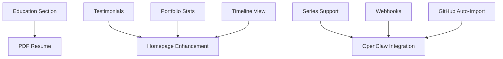

# Implementation Plan - Selected Features

Implementation plan for the approved features from our ideas reorganization.

## ✅ Completed (Session 2026-05-03)

### Quick Wins
- [x] **Code block copy button** - Hover-to-show copy functionality
- [x] **Terminal-style code blocks** - macOS window chrome for project code
- [x] **Skill proficiency bars** - Visual 1-5 scale with animated gradients

## 🚧 In Progress

### Testimonials System
- [ ] MDX-based testimonials in `content/testimonials/`
- [ ] Testimonial card component with avatar, role, company
- [ ] Featured testimonials on homepage
- [ ] Full testimonials page `/testimonials`
- [ ] LinkedIn link integration

**Status**: Folder structure created, example template ready

## 📋 High Priority (Next Up)

### Portfolio Stats
- [ ] Count total projects, blog posts, years of experience
- [ ] Display prominently on homepage hero
- [ ] Animated counter components
- [ ] Real-time calculation from content

### Timeline View
- [ ] Visual timeline component
- [ ] Combine experience + projects by date
- [ ] Interactive timeline with filtering
- [ ] Placement: Homepage or `/timeline` page

### Related Posts
- [ ] Tag-based similarity algorithm
- [ ] Display 2-3 related posts at end of blog
- [ ] Fallback to recent posts if no matches

## 📌 Medium Priority

### Series Support (for Blog)
- [ ] Add `series` and `seriesOrder` to blog frontmatter
- [ ] Series navigation component (prev/next in series)
- [ ] Series overview page
- [ ] Series archive/listing
- **Purpose**: OpenClaw/Hermes will auto-create series

### Education Section
- [ ] Add `content/education/` folder
- [ ] Education MDX schema (school, degree, dates, description)
- [ ] Display on resume page
- [ ] Optionally show on about page

## 🔗 Integrations

### GitHub Activity Widget
- [ ] Fetch recent commits/PRs via GitHub API
- [ ] Display on homepage or about page
- [ ] Cache with SWR or React Query
- [ ] Fallback when API rate limited

### Spotify / Stats.fm Widget
- [ ] Stats.fm API integration for music taste
- [ ] Currently playing / top tracks display
- [ ] Optional placement on `/now` page
- [ ] Respect privacy (only show if opted in)

## 🤖 Automation Features

### GitHub Repo Auto-Importer
- [ ] CLI script to fetch repos from GitHub API
- [ ] Generate project MDX from README
- [ ] Extract tags from topics
- [ ] Auto-populate demo/github URLs
- [ ] **Integration**: Works with OpenClaw/Hermes

### Webhooks for Automation
- [ ] POST /api/webhooks/content endpoint
- [ ] Accept blog/project/experience creation
- [ ] Validate webhook signatures
- [ ] Support for OpenClaw/Hermes agents

## 📄 PDF Resume Generation

This is a big feature - auto-generate resume PDF from existing data:

### Data Sources
- Experience entries (`content/experience/`)
- Education entries (`content/education/`)
- Skills from about page
- Avatar and bio from `config/site.yaml`

### Implementation Options
1. **@react-pdf/renderer** - React components to PDF
2. **Puppeteer** - Render `/resume` page to PDF
3. **jsPDF** - Manual PDF construction

### Features
- [ ] Auto-generate on download button click
- [ ] Optional: Regenerate on content change
- [ ] Template-based layout
- [ ] Multiple style options (classic, modern, minimal)
- [ ] Export as PNG option

**Recommended approach**: Use @react-pdf/renderer for clean, maintainable PDF generation.

## 🎯 Dependencies & Order

Suggested implementation order:
1. ✅ Code blocks + Skills (DONE)
2. **Testimonials** (in progress)
3. **Portfolio stats** + **Timeline** (homepage enhancements)
4. **Related posts** (content discovery)
5. **Education** + **Series support**
6. **GitHub activity** + **Spotify** (nice-to-haves)
7. **PDF resume** (complex but valuable)
8. **Webhooks** + **GitHub importer** (automation layer)

## Notes

- Files prefixed with `_` are ignored by content loaders (e.g., `_example.mdx`)
- All features should respect existing theme/settings system
- Maintain mobile-first responsive design
- Keep bundle size in check (lazy load heavy features)
- Document all new frontmatter fields in validation script

## Time Estimates

- Testimonials: ~30min
- Portfolio stats: ~20min
- Timeline view: ~1hr
- Related posts: ~30min
- Series support: ~45min
- Education section: ~30min
- GitHub activity: ~45min
- Spotify widget: ~1hr
- PDF resume: ~2-3hrs
- Webhooks: ~1hr
- GitHub importer: ~1.5hrs

**Total**: ~10-12 hours of focused work
